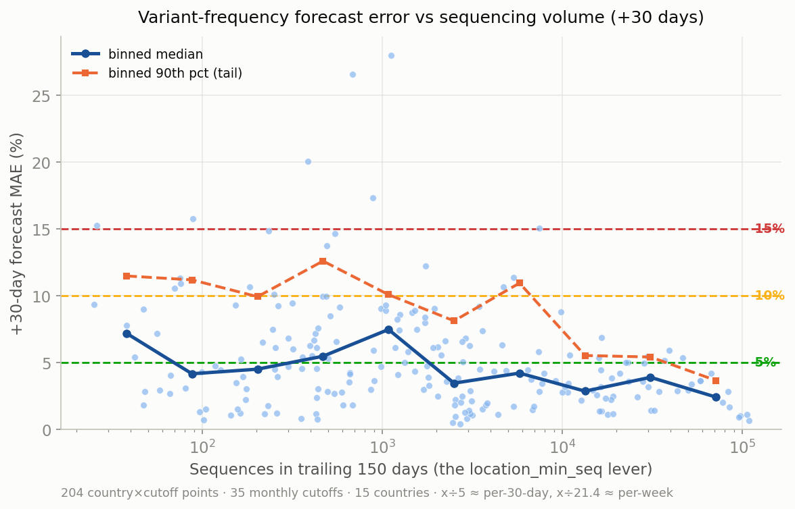
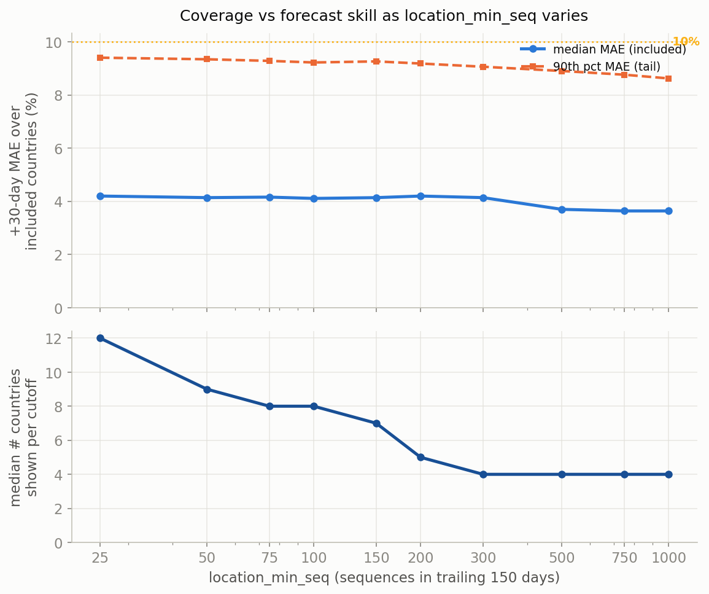

# Choosing `location_min_seq`: a +30-day forecast backtest

## Why

`location_min_seq` decides which countries enter the global MLR analysis (≥ this many
sequences in the trailing `location_min_seq_days` = 150-day window). Global sequencing
has collapsed, so the current values (open/global = 200, gisaid/global = 1000) now admit
only a handful of countries. This analysis re-derives a defensible value for today's
sparse regime by measuring how +30-day forecast accuracy depends on a country's
sequencing volume — the same question as Abousamra, Figgins & Bedford 2024
(*PLoS Comp Biol*), re-run on current data.

## Method

Reuses the production scripts; the only code change is a backward-compatible
`--as-of-date` flag on `scripts/run-mlr-model.py` (anchors the forecast horizon to the
cutoff instead of wall-clock today).

- **Data:** open / nextstrain_clades / global (the public pipeline), full history truncated
  at each cutoff with `prepare-data.py --max-date`.
- **Sliding window:** 35 monthly cutoffs, 2023-10-01 → 2026-08-01. One hierarchical
  `HierMLR` fit per cutoff with a low inclusion floor (`--location-min-seq 20`) so many
  countries spanning the volume range enter the joint fit (confirmed approach: "low-floor
  fits + confirmation").
- **Truth** (paper's definition): empirical variant frequency from the full snapshot in a
  14-day window centred on cutoff+30, with clades outside that cutoff's model set folded
  into `other`. Points with < 10 sequences in the truth window are dropped (truth too noisy).
- **Error:** `MAE = mean over the model's variants of |forecast_freq − truth_freq|` at the
  +30-day target. x-axis = the country's sequences in the trailing 150 days (the lever).

Reproduce: `run-backtest.py` → `score-backtest.py` → `plot-backtest.py`.

## Findings

204 country×cutoff +30-day points across 35 cutoffs and 15 countries. Overall +30-day
MAE: **median 4.2%, mean 5.2%** — the same regime as the paper's ~6% mean for
well-sequenced countries, confirming the pipeline works.

Full per-threshold numbers are in `summary.csv`.

1. **Central error is low across the whole measurable range** (binned median ~2.5–7.5%),
   because the hierarchical model pools strength across countries — so the aggregate MAE
   over *all* included countries is flat (~4% median, ~9% p90) regardless of threshold;
   it is dominated by the always-included large countries.

2. **The low-volume tail is where it breaks.** Looking at the countries *added* at each
   threshold (the `[T, 2T)` marginal band):

   | marginal band (seq/150d) | median MAE | p90 MAE |
   |---|---|---|
   | 25–50   | 7.8% | 11.7% |
   | 50–100  | 4.3% | 11.3% |
   | 100–200 | 3.3% | **8.1%** |
   | 150–300 | 4.2% | 10.2% |

   Below ~100 seq/150d the 90th-percentile error crosses 10% and individual countries
   blow up (Laos @ 26 seqs → 15% MAE, Vietnam @ 75 → 11%). At ≥ ~100 the added countries
   forecast cleanly (median ~3%, p90 ~8%).

3. **Coverage** (all countries passing T in raw open data, median per cutoff):
   25→12, 50→9, 75→8, **100→8**, 150→7, **200→5 (current)**, 300→4, 1000→4.
   Lowering from the current 200 to 100 roughly doubles coverage (5→8) at no skill cost.

## Recommendation (your call — "show curve, decide later")

**`location_min_seq ≈ 100` over 150 days** is the sweet spot: it nearly doubles country
coverage versus the current open value of 200 (≈5 → ≈8 countries), while the countries it
adds still forecast well (marginal median ~3%, p90 ~8%, both under the paper's ~10%
public-display bound). This is ≈ **20 seq / 30 days ≈ 5 seq / week** — notably lower than
the paper's 2022 guideline of ~50/30 days, which the hierarchical pooling now justifies.

- More coverage, higher tail risk: **50–75** (≈9 countries, but marginal p90 ~11%).
- More conservative: **150–200** (≈5–7 countries, cleanest tails).

## Caveats

- **Backfill:** truncating the current snapshot by collection date includes sequences
  deposited after the fact, so it is slightly optimistic vs a true real-time backtest.
- **Truth filter is optimistic at the low end:** requiring ≥10 truth-window sequences drops
  the sparsest cases, so true low-volume error is likely *worse* than shown — another
  reason not to push the threshold too low.
- **Open data only** (134 countries). The skill-vs-volume relationship is in absolute
  sequence counts, so ~100/150d transfers to gisaid, but gisaid (denser) would admit more
  countries at the same count — worth a confirming gisaid run before changing that block.
- Analysis uses nextstrain_clades; pango behaves similarly but was not separately scored.
